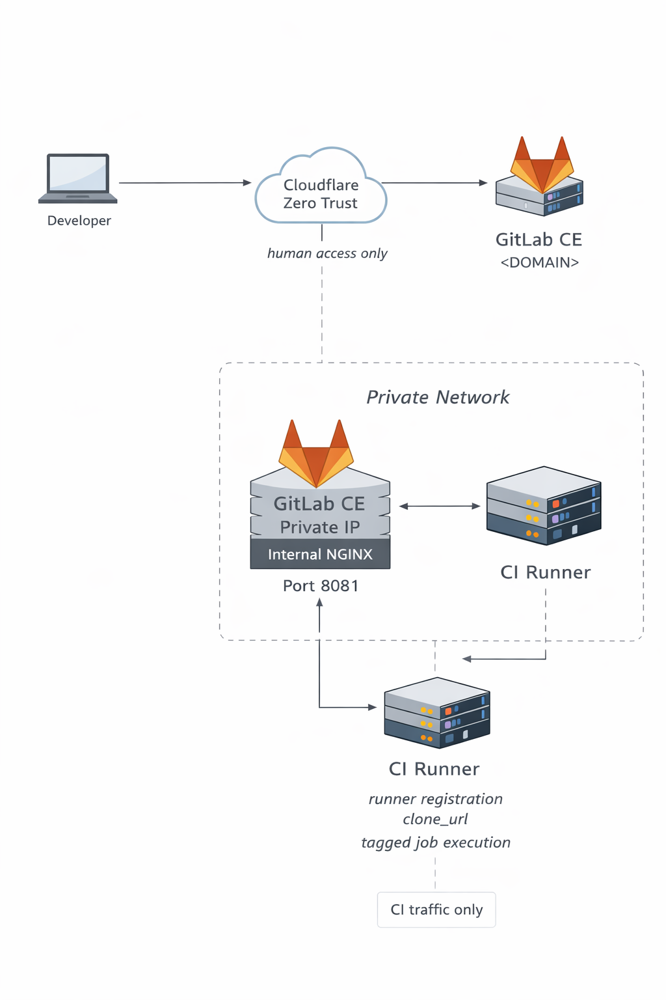

# GitLab SE behind Cloudflare Zero Trust: Part 3. Private CI Runner

This lab extends the earlier **GitLab Behind Cloudflare Zero Trust** setup by adding a **GitLab Runner VM inside the private network**. The key idea is simple: keep **human access** on the public GitLab domain behind Cloudflare Zero Trust, but keep **CI execution and repository checkout** on a **private internal path**.

## Article

Add the Dev.to article link here after publishing.

## What this lab demonstrates

- how to provision a dedicated runner VM in the same private network as GitLab
- how to register an instance runner with Docker executor
- how to keep runner control-plane traffic and repository checkout off the public Cloudflare-protected path
- why a private runner should use an internal NGINX / Workhorse entrypoint instead of Puma directly
- how to avoid duplicate runner registrations during reprovisioning
- how to clean up stale offline runner entries after destroying and recreating the runner VM

## Architecture overview



### Phase 1 — Make it work

- GitLab remains published externally on `https://<DOMAIN>` for human access
- the GitLab VM also exposes a private bundled NGINX listener on `http://<GITLAB_VM_PRIVATE_IP>:8081`
- the runner VM registers against that internal listener
- the runner sets `clone_url` to the same internal listener
- the smoke pipeline proves that checkout and job execution work on the private runner

### Phase 2 — Reduce trust / Harden access

- disable privileged Docker mode
- disable `Run untagged jobs`
- use explicit runner tags in the pipeline
- keep CI traffic on the internal path instead of the public domain

## Why the internal GitLab listener was needed

The previous GitLab setup exposed ports that worked for the earlier access model, but not for private CI checkout:

- port `80` was not listening internally
- port `8080` reached Puma directly, which was good enough for some app traffic but not for Git checkout
- public repository checkout through `https://<DOMAIN>` was redirected to Cloudflare Access login

This lab fixes that by enabling bundled NGINX on the private interface and using that listener for both:

- `url`
- `clone_url`

That keeps the runner path inside the private network and uses a supported Git HTTP entrypoint.

## Repository structure

```text
GitLabSE-private-runner/
├── README.md
├── runbook.md
├── docs/
│   └── architecture.md
├── provision/
│   ├── gitlab/
│   │   └── install_gitlab.sh
│   └── runner/
│       ├── cleanup-stale-runners.sh
│       ├── provision-runner.sh
│       └── register-runner.sh
└── examples/
    └── private-runner-smoke/
        ├── .gitlab-ci.yml
        └── README.md
```

## How to use this repository

1. Update the GitLab VM provisioner so GitLab exposes a private NGINX listener on the private IP
2. Provision or reprovision the GitLab VM
3. Set the runbook environment variables
4. Provision the runner VM
5. Create the demo project and push the smoke example
6. Validate that the pipeline runs on the private runner and that checkout stays on the internal path

## Scope and non-goals

### In scope

- one private runner VM
- instance runner registration
- Docker executor
- private repository checkout
- a minimal validation pipeline

### Non-goals

- autoscaling runners
- ephemeral runners
- runner fleets for multiple environments
- artifact storage design
- production hardening of every GitLab service port
- full redesign of the previous Cloudflare / reverse-proxy path

## Extensions / next ideas

- add a second runner with stricter tags
- move from registration tokens to a newer runner creation workflow
- add a lab for isolated build networks
- add a lab for ephemeral runners

## Published labs in this series

- **Securing a Remote Linux Host with firewalld and OpenVPN**
  - article: https://dev.to/iuri_covaliov/securing-a-remote-linux-host-with-firewalld-and-openvpn-291g
  - repo: https://github.com/iuri-covaliov/devops-labs/tree/main/ProtectRemoteHostWithFirewallAndVPN

- **GitLab Behind Cloudflare Zero Trust**
  - article: https://dev.to/iuri_covaliov/self-hosting-gitlab-behind-cloudflare-zero-trust-a-practical-devops-lab-18ce
  - repo: https://github.com/iuri-covaliov/devops-labs/tree/main/GitLabSE-behind-CloudFlare

- **Replacing Static AWS Credentials in CI/CD with GitHub OIDC**
  - article: https://dev.to/iuri_covaliov/replacing-static-aws-credentials-in-cicd-with-github-oidc-a-practical-devops-lab-2222
  - repo: https://github.com/iuri-covaliov/devops-labs/tree/main/GitHubActionswithAWSOIDC
