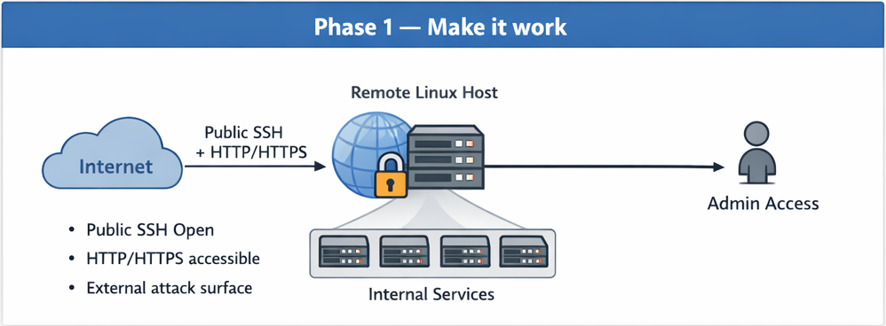
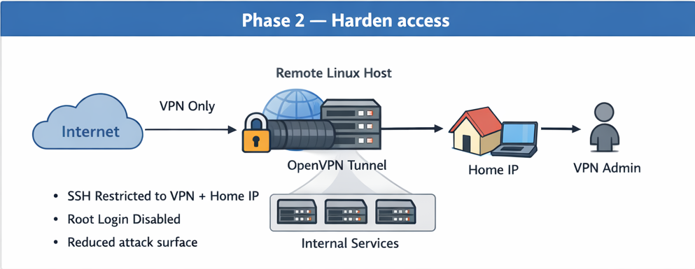
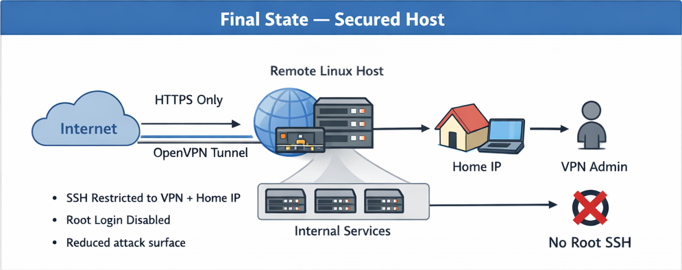

# Securing a Remote Linux Host with firewalld and OpenVPN

Complete step‑by‑step reproducible runbook

------------------------------------------------------------------------

# Prerequisites

-   Ubuntu 24.04 server
-   Non-root admin user with sudo
-   Provider rescue console access confirmed
-   Current SSH session kept open during firewall changes

------------------------------------------------------------------------

# Phase 1 --- Make it work

Goal: Establish deterministic firewall baseline while keeping SSH
accessible.



------------------------------------------------------------------------

## 1. Disable UFW (if enabled)

Check status:

    sudo ufw status

If active:

    sudo systemctl disable --now ufw
    sudo ufw disable

Verify:

    sudo ufw status

Expected: inactive

------------------------------------------------------------------------

## 2. Install firewalld

    sudo apt update
    sudo apt install -y firewalld

Enable and start:

    sudo systemctl enable --now firewalld
    sudo systemctl status firewalld --no-pager

------------------------------------------------------------------------

## 3. Apply deterministic firewall baseline

Script reference:
[examples/firewalld/phase1/firewalld-init.sh](../examples/firwalld/phase1/firewalld-init.sh)

Install and execute:

    sudo cp examples/firewalld/phase1/firewalld-init.sh /etc/firewalld-init.sh
    sudo chmod 700 /etc/firewalld-init.sh
    sudo /etc/firewalld-init.sh

Verify:

    sudo firewall-cmd --zone=public --list-all

------------------------------------------------------------------------

## 4. Persist configuration with systemd

Script reference:
[examples/firewalld/phase1/firewalld-init.service](../examples/firwalld/phase1/firewalld-init.service)

Install:

    sudo cp examples/firewalld/phase1/firewalld-init.service /etc/systemd/system/
    sudo systemctl daemon-reload
    sudo systemctl enable --now firewalld-init.service

Reboot the server:

    sudo reboot

Check the status:

    sudo systemctl status firewalld-init.service --no-pager

------------------------------------------------------------------------

## Phase 1 Validation checklist

- SSH access works from the public internet
- Only intended ports are reachable externally
- firewalld rules survive reboot
- No unintended services are exposed

------------------------------------------------------------------------

# Phase 2 --- Reduce trust / Harden access

Goal: Move administrative access to private VPN plane and remove public
SSH exposure.

Keep SSH session open during changes.



------------------------------------------------------------------------

## 1. Install OpenVPN and Easy-RSA

    sudo apt update
    sudo apt install -y openvpn easy-rsa

------------------------------------------------------------------------

## 2. Build PKI (non-root admin user)

    make-cadir ~/openvpn-ca
    cd ~/openvpn-ca
    ./easyrsa init-pki
    ./easyrsa build-ca
    ./easyrsa gen-req server nopass
    ./easyrsa sign-req server server
    ./easyrsa gen-dh
    openvpn --genkey secret ta.key
    ./easyrsa gen-req client1 nopass
    ./easyrsa sign-req client client1

------------------------------------------------------------------------

## 3. Deploy server materials

    sudo mkdir -p /etc/openvpn/server
    sudo cp pki/ca.crt /etc/openvpn/server/
    sudo cp pki/dh.pem /etc/openvpn/server/
    sudo cp pki/private/server.key /etc/openvpn/server/
    sudo cp pki/issued/server.crt /etc/openvpn/server/
    sudo cp ta.key /etc/openvpn/server/
    sudo chmod 600 /etc/openvpn/server/server.key

------------------------------------------------------------------------

## 4. Create server configuration

Create:

    sudo nano /etc/openvpn/server/server.conf

Use configuration stored in:
[examples/openvpn/server.conf](../examples/openvpn/server.conf)

Ensure split tunnel mode (no redirect-gateway, no pushed DNS).

------------------------------------------------------------------------

## 5. Enable IP forwarding

    echo 'net.ipv4.ip_forward=1' | sudo tee /etc/sysctl.d/99-openvpn.conf
    sudo sysctl --system

------------------------------------------------------------------------

## 6. Update firewall for VPN

In our onfiguration script for firwalld (/etc/firewalld-init.sh) somewhere near the block with
```
firewall-cmd --permanent --zone=public --add-service=http
firewall-cmd --permanent --zone=public --add-service=https

firewall-cmd --permanent --zone=public --add-service=ssh
```
we need to add
```
# OpenVPN
sudo firewall-cmd --permanent --zone=public --add-port=1194/udp
```

Execute:

    sudo cp examples/firewalld/phase2/firewalld-init.sh /etc/firewalld-init.sh
    sudo chmod 700 /etc/firewalld-init.sh
    sudo /etc/firewalld-init.sh

Verify:

    sudo firewall-cmd --zone=public --list-ports

------------------------------------------------------------------------

## 7. Start OpenVPN

    sudo systemctl enable --now openvpn-server@server
    sudo systemctl status openvpn-server@server --no-pager

------------------------------------------------------------------------

## 8. Generate client profile

Script reference:
[examples/openvpn/make-ovpn.sh](../examples/openvpn/make-ovpn.sh)

Generate:

    ./make-ovpn.sh client1

Transfer generated file to workstation and connect.

On your local machine:
- Install OpenVPN client if you don't have it yet
- Import client configuration (client1.ovpn)
  OpenVPN -> My Profiles -> (+) -> Upload File -> select ovpn file
- Connect to VPN

------------------------------------------------------------------------

## 9. Validate VPN connectivity

-   VPN connects
-   10.8.0.x assigned
-   SSH via VPN works
-   Internet works (split tunnel)

------------------------------------------------------------------------

## 10. Restrict SSH and RDP

Now that VPN works, and we are going to restrict SSH. Befor starting:
- Keep your current SSH session open.
- Make sure you can SSH via VPN already:
```
    ssh <admin-user>@10.8.0.1
```
- Confirm your current public IP (from your home):
```
    curl -s https://ifconfig.me && echo
```
Copy that IP (example: 203.0.113.10). We’ll refer to it as HOME_IP.

Now we are ready. At first we will do all manually to learn commands, validate, then update our configuration script to make changes permanent.

Remove global exposure.

    sudo firewall-cmd --permanent --zone=public --remove-service=ssh
    sudo firewall-cmd --permanent --zone=public --remove-port=3389/tcp

Allow only VPN + home IP:

    sudo firewall-cmd --permanent --zone=public   --add-rich-rule="rule family='ipv4' source address='10.8.0.0/24' service name='ssh' accept"
    sudo firewall-cmd --permanent --zone=public   --add-rich-rule="rule family='ipv4' source address='HOME_IP/32' service name='ssh' accept"
    sudo firewall-cmd --permanent --zone=public   --add-rich-rule="rule family='ipv4' source address='10.8.0.0/24' port protocol='tcp' port='3389' accept"
    sudo firewall-cmd --permanent --zone=public   --add-rich-rule="rule family='ipv4' source address='HOME_IP/32' port protocol='tcp' port='3389' accept"

    sudo firewall-cmd --reload

### Validate rules are present
```
sudo firewall-cmd --zone=public --list-rich-rules
sudo firewall-cmd --zone=public --list-services
```
You want:
- ssh NOT in --list-services
- rich rules include:
  - source 10.8.0.0/24 -> ssh accept
  - source HOME_IP/32 -> ssh accept
7. 1.7 Test (critical)
From a VPN-connected machine:
```
ssh <admin-user>@10.8.0.1

```
Should work.

From home public IP (not on VPN), to public IP:
```
ssh <admin-user>@YOUR_PUBLIC_IP
```
Should work.

From anywhere else (mobile hotspot, a VPS, etc.):
```
ssh <admin-user>@YOUR_PUBLIC_IP
```
Should fail / timeout.

### Make the changes persistent in /etc/firewalld-init.sh

The pattern bellow seta defaults, then allowa SSH only from approved sources using rich rules.

1. Add variables at the top (editable)
- VPN_SUBNET
- HOME_IP
2. Script snippet to include
```
# --- SSH restrictions: ONLY from VPN + Home IP ---

VPN_SUBNET="10.8.0.0/24"
HOME_IP="203.0.113.10/32"   # <-- change this

# Ensure SSH is not globally exposed
firewall-cmd --permanent --zone=public --remove-service=ssh 2>/dev/null || true
firewall-cmd --permanent --zone=public --remove-port=22/tcp 2>/dev/null || true

# Remove old/duplicate rich rules if you re-run (best-effort cleanup)
firewall-cmd --permanent --zone=public --remove-rich-rule="rule family='ipv4' source address='${VPN_SUBNET}' service name='ssh' accept" 2>/dev/null || true
firewall-cmd --permanent --zone=public --remove-rich-rule="rule family='ipv4' source address='${HOME_IP}' service name='ssh' accept" 2>/dev/null || true

# Add allow rules
firewall-cmd --permanent --zone=public --add-rich-rule="rule family='ipv4' source address='${VPN_SUBNET}' service name='ssh' accept"
firewall-cmd --permanent --zone=public --add-rich-rule="rule family='ipv4' source address='${HOME_IP}' service name='ssh' accept"
```
Then your script continues to do:
```
firewall-cmd --reload
```
3. Apply the script and verify

Final script reference:
[examples/firewalld/phase2/firewalld-init.sh](../examples/firwalld/phase2/firewalld-init.sh)

```
sudo chmod 700 /etc/firewalld-init.sh
sudo /etc/firewalld-init.sh
sudo firewall-cmd --zone=public --list-all
sudo firewall-cmd --zone=public --list-rich-rules
```

### Small “future-proofing” note (so you don’t lock yourself out later)

Home IPs can change.

Two practical approaches:
- When it changes, just update HOME_IP= in the script and rerun it.
- If you want “home network” instead of a single IP, use your ISP CIDR if you have one (often you don’t), or use a trusted jump host.

------------------------------------------------------------------------

## 11. Disable root SSH login

    sudo nano /etc/ssh/sshd_config

Set:

    PermitRootLogin no

Test:

    sudo sshd -t
    sudo systemctl restart ssh

------------------------------------------------------------------------

# Final Validation

-   Public SSH fails
-   Public RDP fails
-   VPN SSH works
-   VPN RDP works
-   Root login blocked
-   Reboot does not break configuration



------------------------------------------------------------------------

# Common Pitfalls

1.  tls-crypt mismatch → rebuild client profile
2.  DNS pushed in split tunnel → remove DNS push
3.  SSH removed before VPN validated → use provider console

------------------------------------------------------------------------
